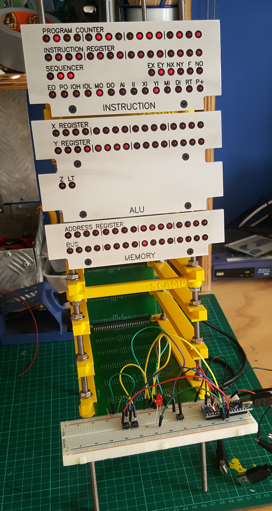

# SCAMP CPU

I am building a simple 16-bit CPU.

This repo is a loosely-connected collection of Verilog source, FreeCAD files, KiCad files, text notes, and software.

It's called "SCAMP" which means something like "Simple Computing and Arithmetic Microcoded Processor".

Here are some pictures:

 

And here's a sample session recorded with `asciinema`:

## Plan

1. Create the CPU in Verilog, with a testbench for each part. **[done]**
2. Replace the raw Verilog with Verilog that only uses 74xx-compatible primitives
   (e.g. https://github.com/TimRudy/ice-chips-verilog), but still passes the testbenches. **[done]**
3. Convert the 74xx-Verilog into KiCad schematics. **[done]**
4. Build the CPU **[still working on this]**

## Current status

I've finished writing Verilog and have settled on the overall CPU architecture (see diagram below).

I'm happy with the instruction set, see [doc/table.html](doc/table.html), available online at https://incoherency.co.uk/interest/table.html - but the instruction set is implemented with microcode, so changes are relatively cheap.

I have some blog posts here: https://incoherency.co.uk/blog/tags/cpu.html

I have created an emulator (see in `emulator/`) and a compiler (`compiler/`). Although there is still useful
work to be done on the compiler, it can now compile itself from within the emulator.

I have written quite a lot of the kernel (see `kernel/`). It can do most of the system calls. It needs more error-checking,
bounds-checking, etc.. It can load programs off a filesystem stored on a block device and execute them, but obviously
only in the emulator since the real CPU doesn't exist yet.

I'm currently designing the PCBs:

 - [x] ALU
 - [x] Memory
 - [x] Instruction/control
 - [x] Backplane
 - [ ] Clock
 - [ ] Serial port
 - [ ] Storage

Other work includes:

 - [x] get the PCBs manufactured
 - [ ] work out how to interface with storage and serial
 - [ ] assemble the computer inside a convenient case (WIP: see `case/` and `front-panels/`)
 - [x] write the bootloader ROM (mostly done: see `bootrom.s`)
 - [x] write the "kernel" (mostly done: see `kernel/`)
 - [x] write a compiler
 - [x] write system utilities (mostly done: see `sys/`)
 - [x] write an editor (mostly done: see `sys/kilo.sl`)
 - [ ] make it self-host

## Architecture

It is a 16-bit CPU. The bus is 16-bit, registers are 16-bit, addresses are 16-bit, and memory contents are
16-bit. The upper 8 bits of an instruction select the opcode, and the lower 8 bits are available
for small immediate values. There is no support for: cache, interrupts, virtual memory, DMA, privilege rings,
floating point, and ~anything else that is not strictly necessary.

Here is a diagram of the architecture I currently have in mind:

For more information, see [doc/UCODE.md](doc/UCODE.md) and [doc/ISA.md](doc/ISA.md).

## Try it out

You can run SCAMP/os in the emulator. First you'll need to build everything. Try `make -j` in the root directory of this
repository. It probably won't work on the first attempt because it works with multiple different Makefiles that have
annoying dependencies. Just run `make -j` twice. If that doesn't do the trick, run `make` in `sys/` first, and then run
it in `.`.

Having built everything, you can go into `kernel/` and start it in the emulator with `./run`:

    ~/scamp-cpu/kernel $ ./run
    make: 'os.disk' is up to date.
    SCAMP boot...
    .......................................................OK
    starting kernel...
    loading init...
          ____   ____    _    __  __ ____   __
         / ___| / ___|  / \  |  \/  |  _ \ / /__  ___
         \___ \| |     / _ \ | |\/| | |_) / / _ \/ __|
          ___) | |___ / ___ \| |  | |  __/ / (_) \__ \
         |____/ \____/_/   \_\_|  |_|_| /_/ \___/|___/

    $

If you know how to use Unix you'll probably understand how to use it. If you know how to use CP/M you'll probably
understand how it works.

If you want, you can write SLANG programs using `kilo` and compile them with `slc`. You've probably never written
SLANG before. You can learn how to use it by reading programs under `/src` (or `sys/` in the repo). It's mostly
like C but with fewer features and less safety.

## Resources

I thoroughly recommend the Nand2Tetris course. https://nand2tetris.org/

If you want to do the exercises from Nand2Tetris without learning what a hardware-description language
is, and without going through all the lectures, you can play https://nandgame.com/

Ben Eater's videos on 8-bit CPU design are excellent and heavily influenced
the design of my CPU.

I found the [YouTube playlist](https://www.youtube.com/playlist?list=PLOech0kWpH8-njQpmSNGSiQBPUvl8v3IM) for Nicolas Laurent's [compiler class](https://norswap.com/compilers/) quite helpful
in writing the parser for the compiler.

The [Build Your Own Text Editor](https://viewsourcecode.org/snaptoken/kilo/) is a fantastic tutorial that walks you through implementing
[antirez](https://github.com/antirez)'s [kilo](https://github.com/antirez/kilo) editor.

[Balazs Markus](https://github.com/bazsimarkus)'s [8250 UART example](https://github.com/bazsimarkus/Simple-8250-UART-System-with-Arduino) is helpful.

## Contact

If anything in this repo causes you to want to communicate with the person who wrote it, you can email me on [james@incoherency.co.uk](mailto:james@incoherency.co.uk)
or read my blog: [https://incoherency.co.uk/].
