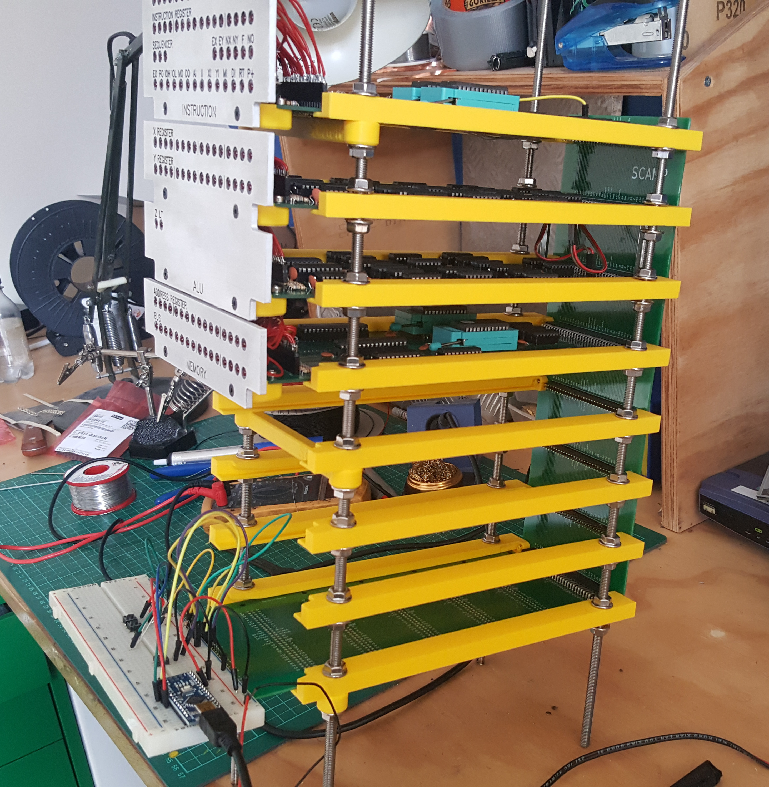
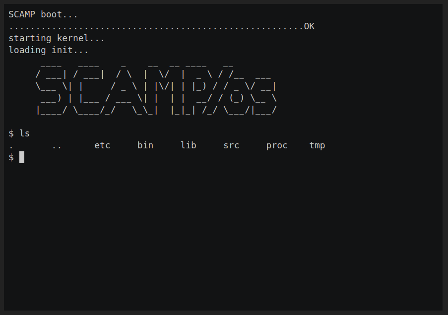
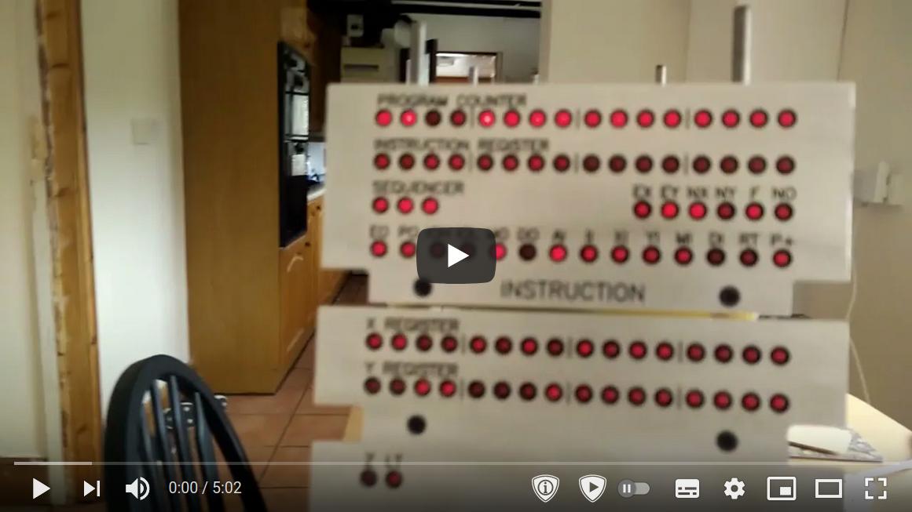
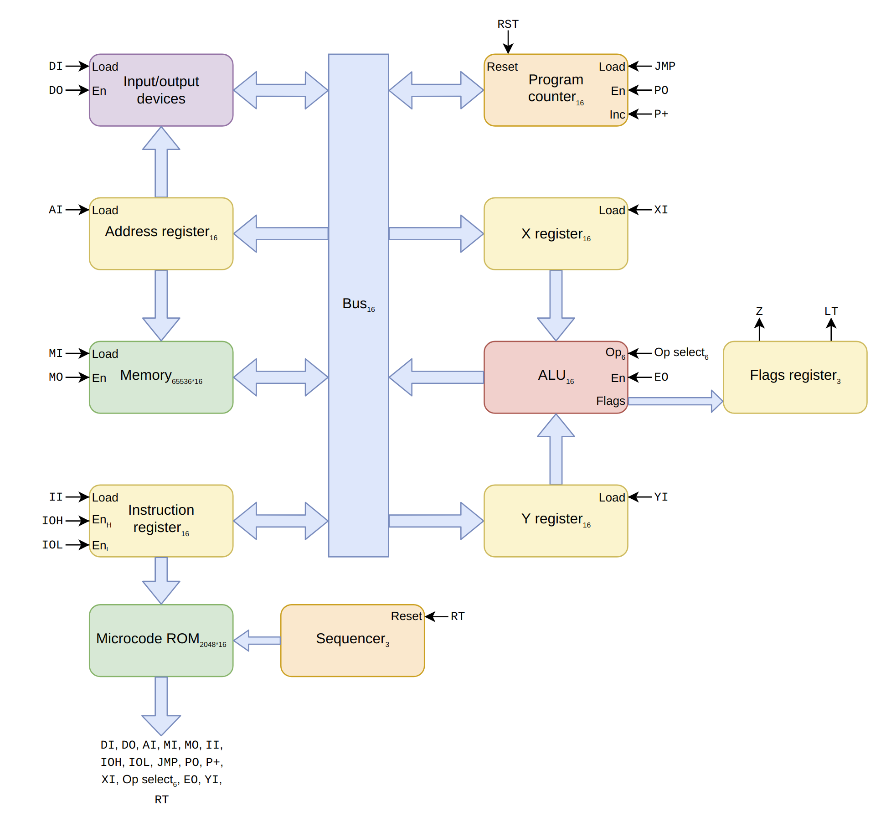

# SCAMP CPU

SCAMP is my homebrew 16-bit CPU. It stands for something like "Simple Computing and Arithmetic Microcoded Processor".

The CPU is very primitive. It doesn't support interrupts, and has no MMU, and no concept of privilege levels. It currently runs
at 1 MHz, above that the CompactFlash interface falls over. It runs a homebrew operating system, with a homebrew
programming language and compiler, and can self-host many of the system utilities (but not all).
The environment tastes a bit like an early Unix, but works like CP/M. I plan to use the computer to complete as much
as possible of this year's [Advent of Code](https://adventofcode.com/).

I have some blog posts here: https://incoherency.co.uk/blog/tags/cpu.html and a web-based emulator available here: https://incoherency.co.uk/scamp/

Here are some pictures:

 

Here's a sample session in the emulator recorded with `asciinema`:

And here's a video with some explanation and an example session on real hardware:

## The story so far

This is what I've already done:

1. Create the CPU in Verilog, with a testbench for each part.
2. Replace the raw Verilog with Verilog that only uses 74xx-compatible primitives
   (e.g. https://github.com/TimRudy/ice-chips-verilog), but still passes the testbenches.
3. Convert the 74xx-Verilog into KiCad schematics.
4. Order the PCBs and components, solder up the PCBs, build a card cage, build a wooden case.
5. Settle on the instruction set and write the microcode (see [doc/table.html](doc/table.html), available online at https://incoherency.co.uk/interest/table.html).
5. Write a bootloader, kernel, shell, text editor, compiler, and various system utilities.

## Next steps

The computer already works, and I suspect it will never be "finished", but some things I still want to work on are:

#### Hardware

 - [x] make some levers that sit on the case at the side of the cards to aid removal of the cards
 - [ ] build a hardware multiplication card (and maybe division?)
 - [ ] build a hardware RNG
 - [x] make the CompactFlash interface more reliable

#### Low-level software

 - [ ] make kernel self-hosting (compile within SCAMP/os & write to disk)
 - [ ] make library blob self-hosting (compile within SCAMP/os)
 - [x] support multiple different library blobs (e.g. to toggle the large parts on/off)
 - [ ] write an strace-like debugging tool
 - [ ] write a DDT-like debugging tool
 - [ ] write a peephole optimiser to run within SCAMP/os
 - [ ] find out whether changing the calling convention to return values on the stack is overall better or worse
 - [ ] utilities: du,df,fsck

#### Other software

 - [x] make the shell support pipe syntax (e.g. `foo | bar | baz`)
 - [ ] write a big-fixed-point arithmetic library
 - [ ] fixed-point mathematics: pow,sqrt
 - [ ] fixed-point trigonometry: sin,cos,tan,asin,acos,atan,atan2 (partly done)
 - [ ] solve some of this year's [Advent of Code](https://adventofcode.com/) using the SCAMP hardware
 - [ ] write a FORTH implementation (should it run on bare metal or under SCAMP/os?)
 - [ ] write a Z-machine interpreter and port some text adventures
 - [ ] write some games (pong? breakout? snake? tetris?)

If you happen to want to work on any of the above, I'd be happy to help you!

## Architecture

It is a 16-bit CPU. The bus is 16-bit, registers are 16-bit, addresses are 16-bit, and memory contents are
16-bit. The upper 8 bits of an instruction select the opcode, and the lower 8 bits are available
for small immediate values. There is no support for: cache, interrupts, virtual memory, DMA, privilege rings,
floating point, and ~anything else that is not strictly necessary.

Here is a diagram of the architecture:

For more information, see [doc/UCODE.md](doc/UCODE.md) and [doc/ISA.md](doc/ISA.md).

## Try it out

The easiest way to try it out is to use the web-based emulator at https://incoherency.co.uk/scamp/

If you want to run it locally, first you'll need to build everything. Try `make -j` in the root directory of this
repository. It probably won't work on the first attempt because it works with multiple different Makefiles that have
annoying dependencies. Just run `make -j` twice. If that doesn't do the trick, run `make` in `sys/` first, and then run
it in `.`.

Having built everything, you can go into `kernel/` and start it in the emulator with `./run`:

    ~/scamp-cpu/kernel $ ./run
    make: 'os.disk' is up to date.
    SCAMP boot...
    .......................................................OK
    starting kernel...
    loading init...
          ____   ____    _    __  __ ____   __
         / ___| / ___|  / \  |  \/  |  _ \ / /__  ___
         \___ \| |     / _ \ | |\/| | |_) / / _ \/ __|
          ___) | |___ / ___ \| |  | |  __/ / (_) \__ \
         |____/ \____/_/   \_\_|  |_|_| /_/ \___/|___/

    $

If you know how to use Unix you'll probably understand how to use it. If you know how to use CP/M you'll probably
understand how it works.

If you want, you can write SLANG programs using `kilo` and compile them with `slc`. You've probably never written
SLANG before. You can learn how to use it by reading programs under `/src` (or `sys/` in the repo). It's mostly
like C but with fewer features and less safety.

## Resources

I thoroughly recommend the Nand2Tetris course. https://nand2tetris.org/

If you want to do the exercises from Nand2Tetris without learning what a hardware-description language
is, and without going through all the lectures, you can play https://nandgame.com/

Ben Eater's [videos on 8-bit CPU design](https://www.youtube.com/watch?v=HyznrdDSSGM&list=PLowKtXNTBypGqImE405J2565dvjafglHU) are excellent and heavily influenced
the design of my CPU.

I found the [YouTube playlist](https://www.youtube.com/playlist?list=PLOech0kWpH8-njQpmSNGSiQBPUvl8v3IM) for Nicolas Laurent's [compiler class](https://norswap.com/compilers/) quite helpful
in writing the parser for the compiler.

The [Build Your Own Text Editor](https://viewsourcecode.org/snaptoken/kilo/) is a fantastic tutorial that walks you through implementing
[antirez](https://github.com/antirez)'s [kilo](https://github.com/antirez/kilo) editor.

[Balazs Markus](https://github.com/bazsimarkus)'s [8250 UART example](https://github.com/bazsimarkus/Simple-8250-UART-System-with-Arduino) is helpful.

Daniel Tufvesson has a post that is a good starting point for understanding the [8-bit CompactFlash interface](http://www.waveguide.se/?article=8-bit-compact-flash-interface).

[PickledDog](https://github.com/PickledDog) has a description of an [improvement to the RC2014 CompactFlash card](https://github.com/PickledDog/rc-cfcard) that might be helpful. Also [Bill Shen's comment on the RC2014 mailing list](https://groups.google.com/g/rc2014-z80/c/LmvGa6PZNhQ/m/H8jrbp86AQAJ).

Michał Cierniak has a good blog post about [CompactFlash + 8255 interface card](https://ciernioo.wordpress.com/2015/02/10/compact-flash-8255-interface-card/) with lots
of detail on how his CompactFlash interface works.

SCAMP is featured on the [Homebrew CPU ring](https://www.homebrewcpuring.org/) which also features many other interesting homebrew CPU designs.

## Contact

You can email me on [james@incoherency.co.uk](mailto:james@incoherency.co.uk)
or read my blog: [https://incoherency.co.uk/].
